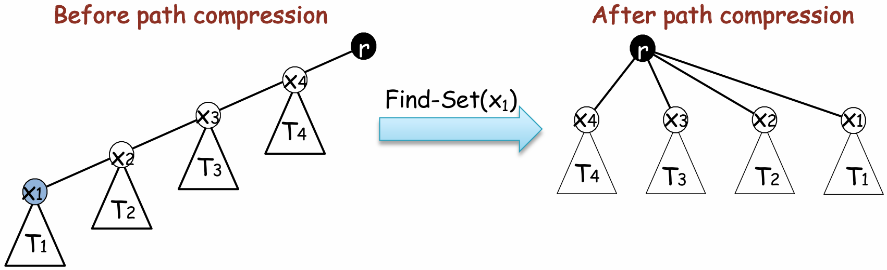

# union-find data sturcture
---
## applications
1. Given an undirected graph and an arbitrary pair of vertices (u, v), check whether u and v are in the same connected component of the graph
   - tricks: using **Weighted-union heuristic**,we append the shorter list to the longer list
      - time complexity:$O(m+nlogn)$, $m$ is the operations for make-set, $n$ is the total num of vertices, $nlogn$ is the operations for changing parent pointer.  

2. dis-joint set implementation: forest
   - tips:
     - union by rank(height of subtree)
        
     - path compression
        

3. minimum spanning tree

