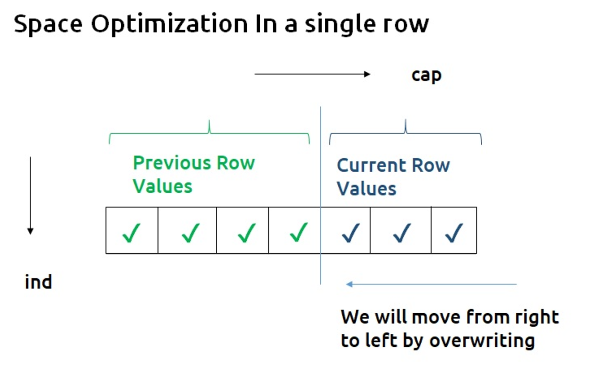

# DP problem
- **fibonacci numbers problem**
  优化流程：top to bottom $\rightarrow$ top to bottom using memoization $\rightarrow$ bottom up using tabulation 
- **longest common subsequence**
  是按照原始排列顺序组成的字串，可以不连续
    >input: x,y -string
    >output: z, -longeest common subsequence of x,y
  
  课后练习：
    1. Draw a DP table for computing the LCS between XAYBZ and CXYZW
    1. Write the full version codes of LCS, which not only compute the LCS length but also the LCS itself
    2. 对于LCS 时间复杂度的优化：using the method of Four Russians
    3. 如果只需要求length，对空间复杂度的优化，只存储维护两行table
- **unbounded knapsack problem**
  维护一维数组，
- **0-1 knapsack problem**
  [对空间复杂度进行优化，只需要维护一维数组](https://takeuforward.org/data-structure/0-1-knapsack-dp-19/)
  
    
  - 时间复杂度：$O(n*W)$ ,但是因为内存原因，其实是指数量级增长的, $O(n^2)$

- **rob cutting**

- **longest increasing subsequence**
  将序列转有向图
- **Longest zig-zag subsequence**
  

