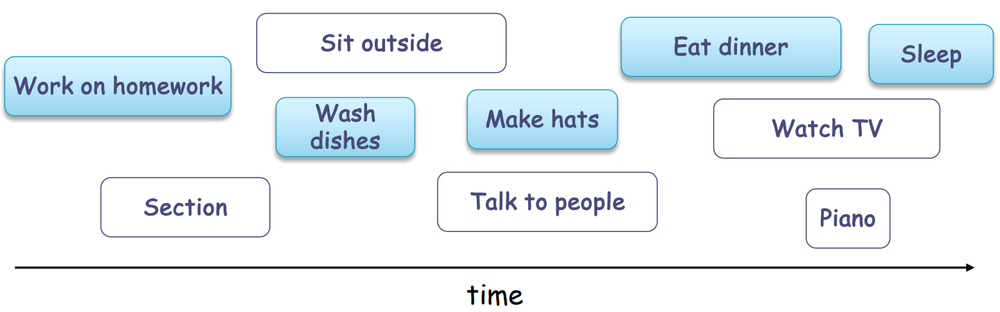

# greedy algorithms
- **minimum spanning tree problem**
  涉及的概念：
  - spanning tree， 大小是（图的顶点数-1）
    能生成 spanning tree 的前提是图是连通的
  - minimum spanning tree：生成树权重和最小
    解决算法：Kruskal’s algorithm
    - 假设原有的图没有边，每个都是孤立的
    - 按照边的权重升序排列，选边
    - 如果边能够连接孤立的群，add
    - 如果不能，skip
    - 直到只剩下1个群

- **activity-selection problem**
  - 按照结束时间升序排列，每次选取结束时间最早的作为optimal choices
  
  时间复杂度：$`O(n\cdot logn)`$
- **scheduling problem**
  - ratio cost/time as greedy choice，按照比率升序排列
  - 时间复杂度：$`O(n \cdot logn)`$
    基本上时间复杂度只与选择的排序算法有关
  
- **huffman tree problem**
  - 每次选频率最小的两个建树，得到频率和，加入到优先队列维护
  - iterate
- **A star search**
- **coin changing problem
  求最小找零钞票/硬币总数
  跟面额集合有关，例如{1，5，10，50}就可以用“每次选择最大面额”求解，而{1，3，4}就不行，转而用DP解决。
  
